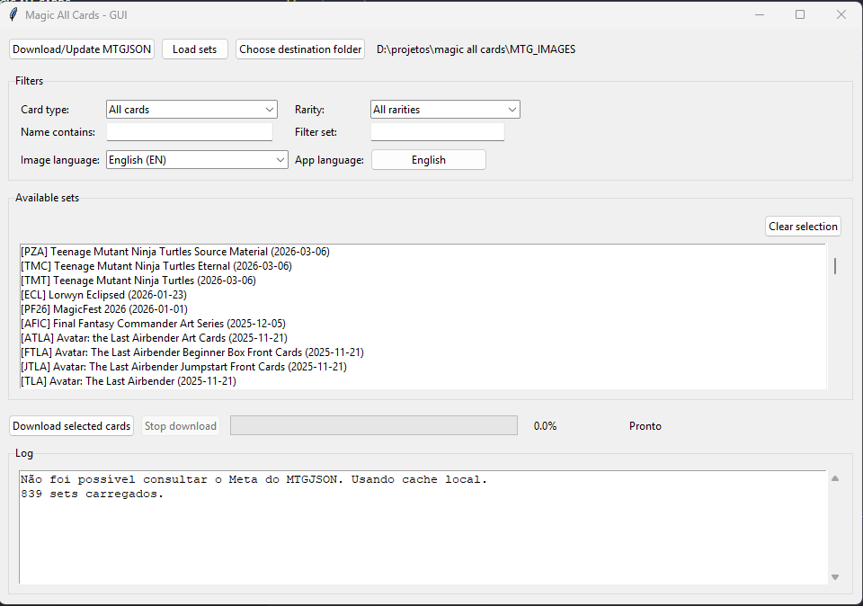

# Magic All Cards (GUI)



Aplicativo gráfico para baixar imagens de cartas de Magic: The Gathering direto do Scryfall utilizando o banco `AllPrintings.json` do MTGJSON.

> Prefer you read in English? See the [README.md](README.md).

## Funcionalidades principais
- **Sincronização automática com o MTGJSON:** consulta `Meta.json`, baixa/atualiza o `AllPrintings.json` (~1 GB) e carrega os sets sem interação manual.
- **Interface bilíngue:** toda a GUI/log (botões, labels, diálogos) está disponível em português e inglês. O app inicia em inglês para facilitar o compartilhamento, mas basta usar o campo "Idioma do app" para voltar ao português; a escolha fica salva em `config.json`.
- **18 idiomas para imagens:** escolha qual tradução do Scryfall baixar (EN, ES, FR, DE, IT, PT, JA, KO, RU, ZHS, ZHT, HE, LA, GRC, AR, SA, PH, QYA). Caso a carta não exista naquela língua, o aplicativo faz fallback automático para a versão em inglês e registra o fato no log.
- **Filtros avançados:** seleção múltipla de sets, filtros por tipo/raridade/nome e apenas cartas com Scryfall ID são enfileiradas.
- **Progresso e alertas:** barra + contador textual. Se o lote ultrapassar ~40 000 cartas (~10 GB) é necessário confirmar antes de continuar.
- **Estrutura organizada:** arquivos armazenados como `SET/Idioma/Cor/Tipo/Raridade/numero_nome.png`, priorizando terrenos, cores e raridades conforme solicitado.
- **Pronto para distribuição:** funciona com PyInstaller (`--onefile --windowed`), facilitando gerar `.exe` para quem não tem Python instalado.

## Requisitos
- Python 3.10 ou superior.
- Dependências listadas em `requirements.txt` (instale com `pip install -r requirements.txt`).

## Como usar
1. Instale as dependências:
   ```powershell
   pip install -r requirements.txt
   ```
2. Execute a aplicação:
   ```powershell
   python magic_all_cards.py
   ```
3. No app:
   - Aguarde o log indicar o download do `AllPrintings.json` (caso ainda não exista) e o carregamento dos sets – tudo ocorre automaticamente na abertura.
   - Escolha o idioma desejado no campo **Idioma das imagens**. Se o Scryfall não tiver a carta naquela língua, o app baixa a versão em inglês e avisa no log.
   - Ajuste o campo **Idioma do app** (Português/English). A preferência fica salva em `config.json` e é aplicada automaticamente na próxima abertura.
   - Utilize os demais filtros, selecione um ou mais sets e defina a pasta de destino.
   - Pressione **Baixar cartas selecionadas**. Se o lote ultrapassar ~40 000 cartas, confirme antes do download prosseguir.

### Estrutura das pastas geradas
```
<destino>/<SET>/<Idioma>/<Cor>/<Tipo>/<Raridade>/<numero_nome>.png
```
- **Idioma:** um diretório por idioma suportado (`01-English`, `02-Spanish`, etc.), facilitando separar traduções.
- **Cor:** `Branca`, `Azul`, `Preta`, `Vermelha`, `Verde`, `Incolor` ou `Multicolor`.
- **Tipo:** `Terreno`, `Criatura`, `Planeswalker`, `Instant`, `Feitiço`, `Encantamento`, `Artefato`, `Batalha` ou `Outros` (os Terrenos têm prioridade, conforme solicitado).
- **Raridade:** `Comum`, `Incomum`, `Rara`, `Mítica`, `Especial`, `Promo`, `Bônus` ou `SemRaridade`.

## Gerando o executável (.exe)
### Build rápido com PyInstaller
```powershell
pip install pyinstaller
python -m PyInstaller --onefile --windowed --name MagicAllCards magic_all_cards.py
```
- O arquivo `MagicAllCards.exe` ficará em `dist/`.
- Opcional: copie `AllPrintings.json` e `AllPrintings.meta.json` para a mesma pasta do `.exe` antes de distribuir e evite novo download inicial.

### Criando um instalador
1. Gere o `.exe` com PyInstaller (passo anterior).
2. Use ferramentas como [Inno Setup](https://jrsoftware.org/isinfo.php) ou [NSIS](https://nsis.sourceforge.io/).
3. Aponte para os arquivos em `dist/` (incluindo `MagicAllCards.exe` e, se quiser, `AllPrintings*.json`) e gere o instalador.

> Dica: mantenha `AllPrintings.json` na mesma pasta do executável para que o carregamento dos sets seja imediato.

## Dependências
- `requests` para downloads HTTP.
- `tkinter` (vem com o Python padrão no Windows).

## Observações
- `AllPrintings.json` tem cerca de 1 GB; o primeiro download pode demorar dependendo da rede.
- Respeite os limites da API do Scryfall e evite múltiplas instâncias em paralelo.
- Para depurar, execute `python magic_all_cards.py` no terminal e acompanhe o stdout/stderr.
